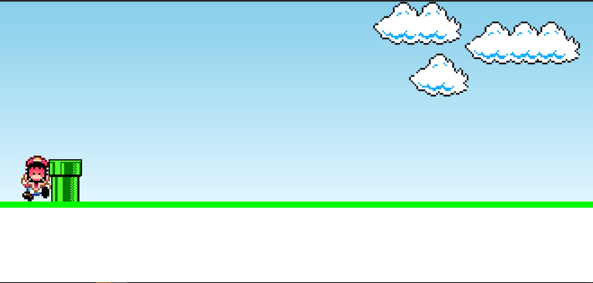

<h1 align="center"> Projeto -Mario Jump- </h1>

## 🚀 Tecnologias utilizadas

- HTML
- CSS
- JavaScript

## 💻 Sobre o Projeto

 
<a href="https://diegoprocopio0.github.io/mario-jump/"> Link do Projeto </a>
 

 
Esse projeto foi baseado em um jogo do mario

 Foi feito um layout para embelezar o projeto e foi emplementado toda uma lógica 

   
 

 By Diego Silva 
